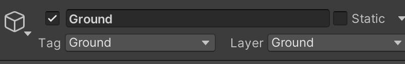
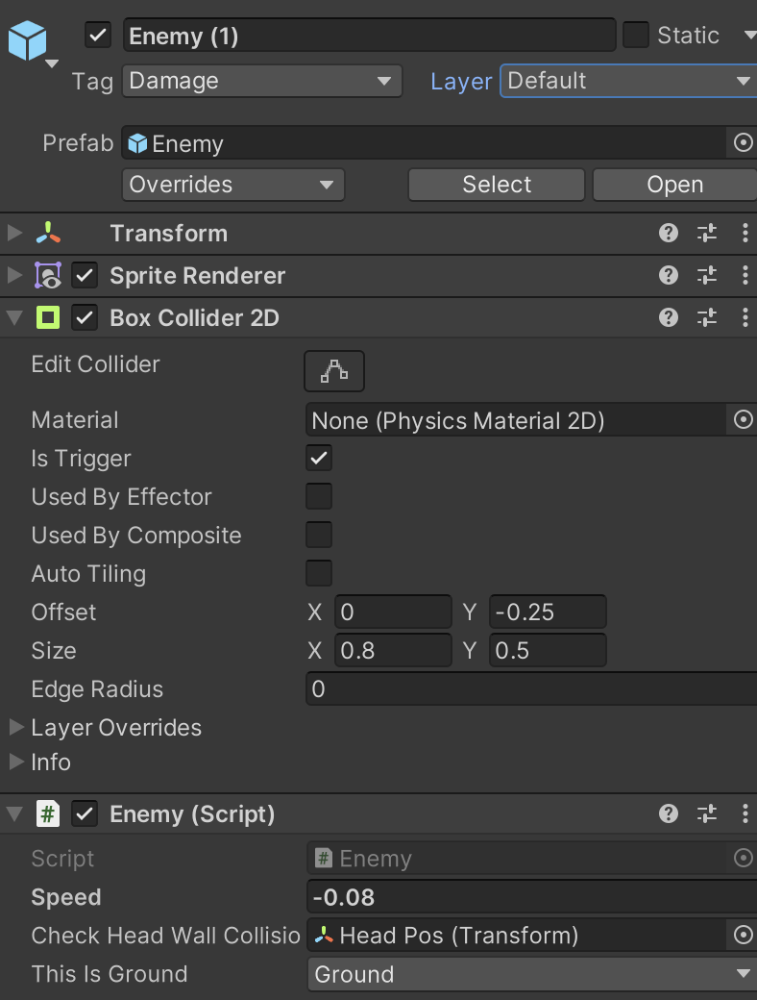

# Unity Workshops: Final Version of Our 2D Platformer
To view all files and assets used throughout the workshop series, follow [these instructions](./../Setting%20up%20a%20Project/README.md) with the [`Assets.zip`](./Assets.zip) file included in this folder.

All scripts in this project have many comments added to further explain what each line is doing.

If you are interested in making your Enemy move back and forth, similar to what I showed at the very beginning of the workshop series, take a look at the files provided in [`Enemy-Moving.zip`](./Enemy-Moving.zip).
- `Enemy.cs` is a script
- `Enemy.prefab` is a Prefab

Once you have an Enemy in your scene, to make it move, set its Speed field in the Inspector to be non-zero. You also have to set your Ground object (under Grid), to have a Layer of 'Ground' (if one doesn't exist, then make it and then assign it). Then, in the Inspector for your Enemy, set 'This Is Ground' to the Ground layer.

.

