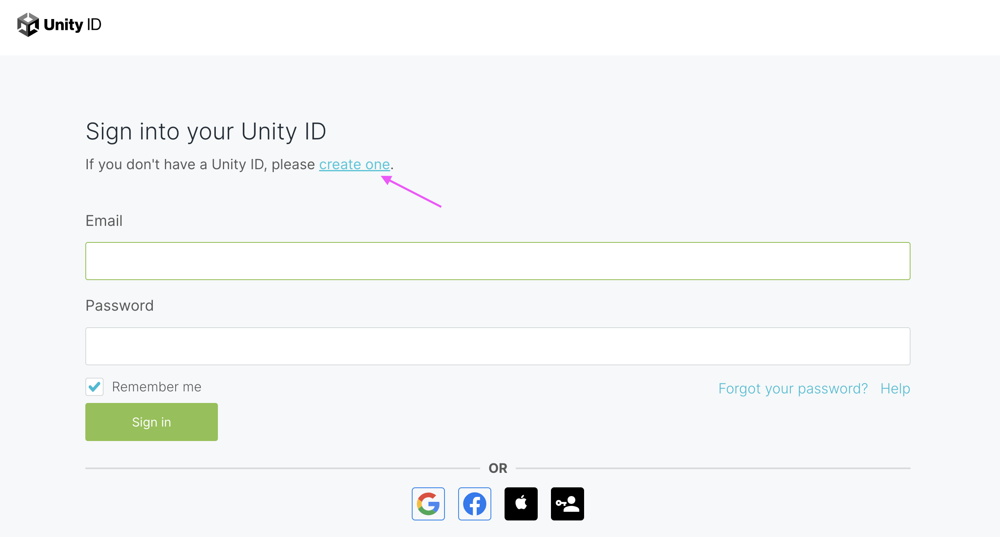
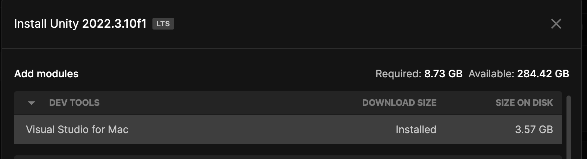
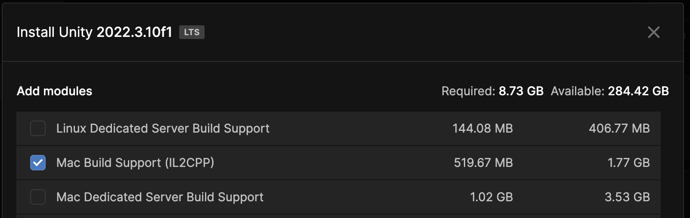
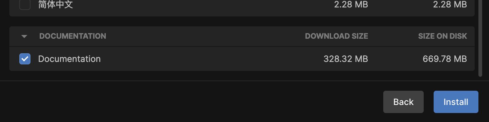
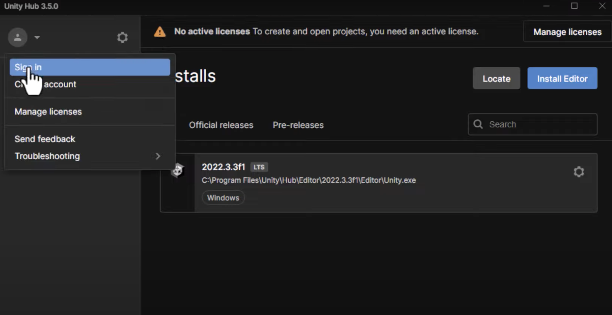
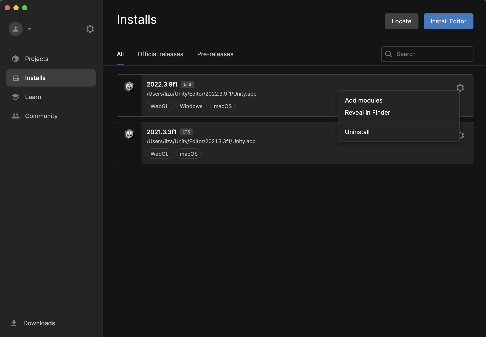

# Installing & Setting Up Unity
1. Sign up for a [Unity ID](https://id.unity.com/)

2. [Download](https://unity.com/download) the Unity Hub for your computer software
    - Accept the Personal license/version when pop-up prompts

3. Install latest Long Term Support (LTS) version
    - Accept pop-up in initial installer
    - As of now that is 2022.3.10f.1
    - Older version of Unity work just fine for these Workshops as well
    - Can install other versions at any time from the Unity Hub

4. During installation, select these options:
    - Visual Studio
    - Plain Build Support for your computer software
        - 'Mac Build Support' for Macs, etc.
    - Documentation
    

    

    

5. Sign into your account in Unity Hub
    
    
    - If no pop-up showed earlier, you might have a banner at the top telling you to Mange License
    - Select the Personal license

At the end, your Unity Hub should look something like this.  Yours would only have one Editor installed, with version 2022.3.10f.1, but you should be able to see 'Add modules' when clicking the gear icon on the right. （●´∀｀）ノ♡
