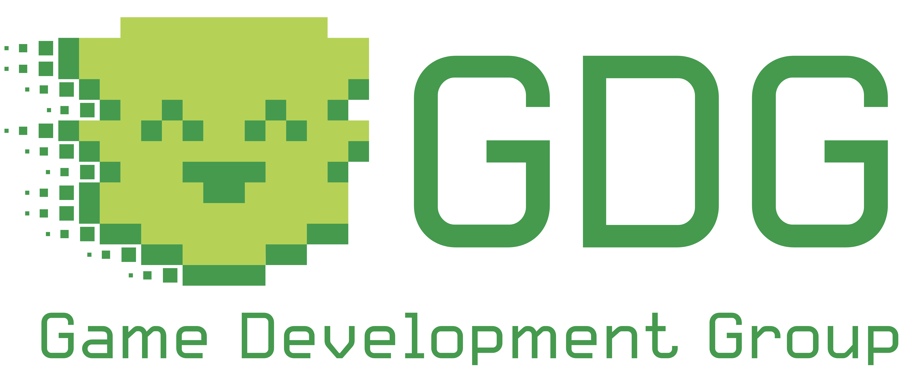

# GDG Unity Workshops

This repo contains all recources and materials needed to participate in the Unity Workshops! (◌˘◡˘◌)

There are individual folders for each Workshop, with individual descriptions:
- [Workshop: Basics](./1%20Basics/)
- [Workshop: Programming](./2%20Programming/)
- [Workshop: Art](./3%20Art/)
- [Workshop: Menus & Timers](./4%20Menus,%20Timers/)
- [Workshop: Events & Audio](./5%20Events,%20Audio/)

Each folder contains individual assets used as well as an `Assets.zip` that you can import into a brand-new 2D Project. 

You can join a workshop without having done the previous ones by [setting up a new project](Setting%20up%20a%20Project/README.md) with the contents of the `Asset.zip`. (\*・‿・)ノ⌒\*:･ﾟ✧

I assume you have [Unity installed](Installing%20Unity/README.md) (covered in the first workshop, Basics).

Thanks for stopping by! ✧♡(◕‿◕✿)