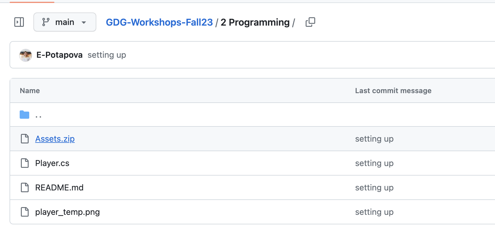
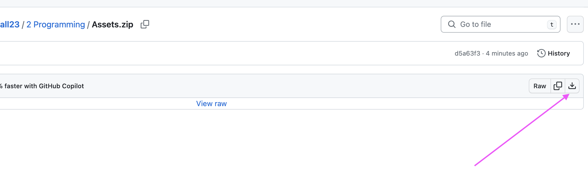
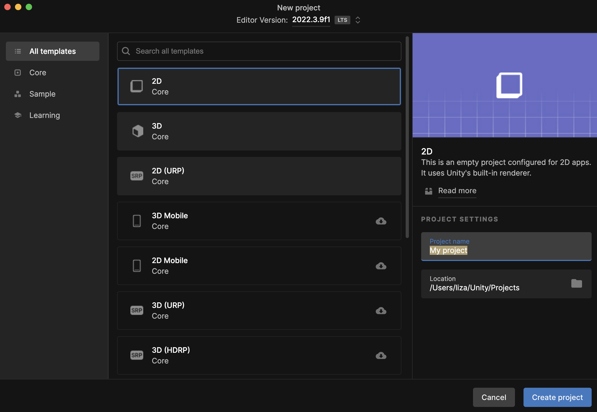
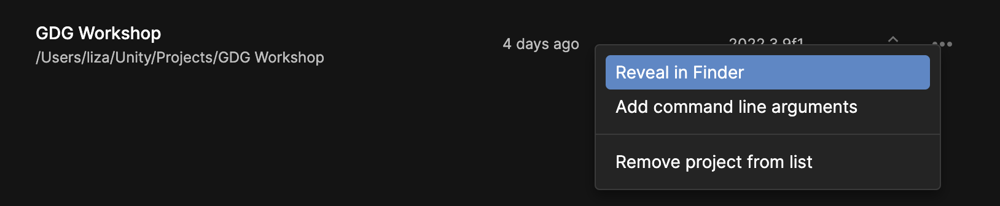

# Setting Up a New Project
I assume that you have [Unity installed](./../Installing%20Unity/README.md) and ready to run.

You can easily join a workshop without doing the previous ones by following these steps:

1. Download `Assets.zip` from the specific workshop folder
    - Click into the workshop folder, click into `Assets.zip`
    
    - Click on the download icon on the right
    
    - Unzip the file on your computer somewhere, it should create an 'Assets' folder with sub-folders named 'Scenes', 'Scripts', 'Sprites', etc.
1. Create a new 2D Project
    - Go to 'Projects' tab on the left, then 'New Project' in top-right
    - Name it whatever you want
    
1. Wait for it to set up, close window afterwards
    - It will take a bit and open a Unity Editor window after it's done
    - Close that for now
1. Open the Project in your file browser
    - Go to 'Projects' tab on left, then click on gear icon to the right of your project name, click 'Reveal in X'
    
1. Replace the pre-generated Assets folder with the provided Assets
    - Click into the project folder
    - Delete the 'Assets' folder that exists inside
    - Drag (copy over) the downloaded and unzipped Assets folder into the project folder
1. Open the project and open a Scene found in the Scenes folder
1. Run the game and make sure everything runs accordingly
    - Specified by the workshop you are setting up for